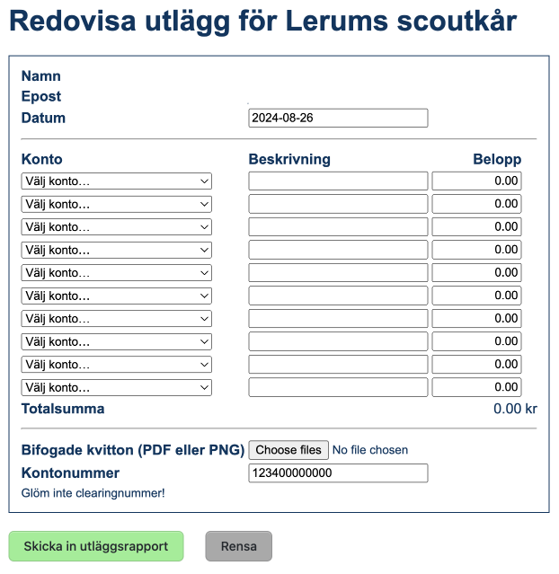

# Redovisa

_Redovisa_ är en webbapp för att på ett enkelt sätt kunna rapportera utlägg och därefter skicka resultatet via epost. Applikationen skrevs ursprungligen för att underlätta ekonomihanteringen inom Lerums scoutkår.

## Funktioner

- Inloggning sker via OpenID Connect
- Sessioner lagras i [Redis](https://redis.io/) eller i internminnet
- En lista med epostadresser på godkända användare kan konfigureras
- Webbsidor och epost styrs via mallar och variabler
- Kvitton och underlag skickas via SMTP

## Konfiguration

Konfigurationen läses in från filen [`redovisa.toml`](redovisa.exempel.toml).

## Exempel

